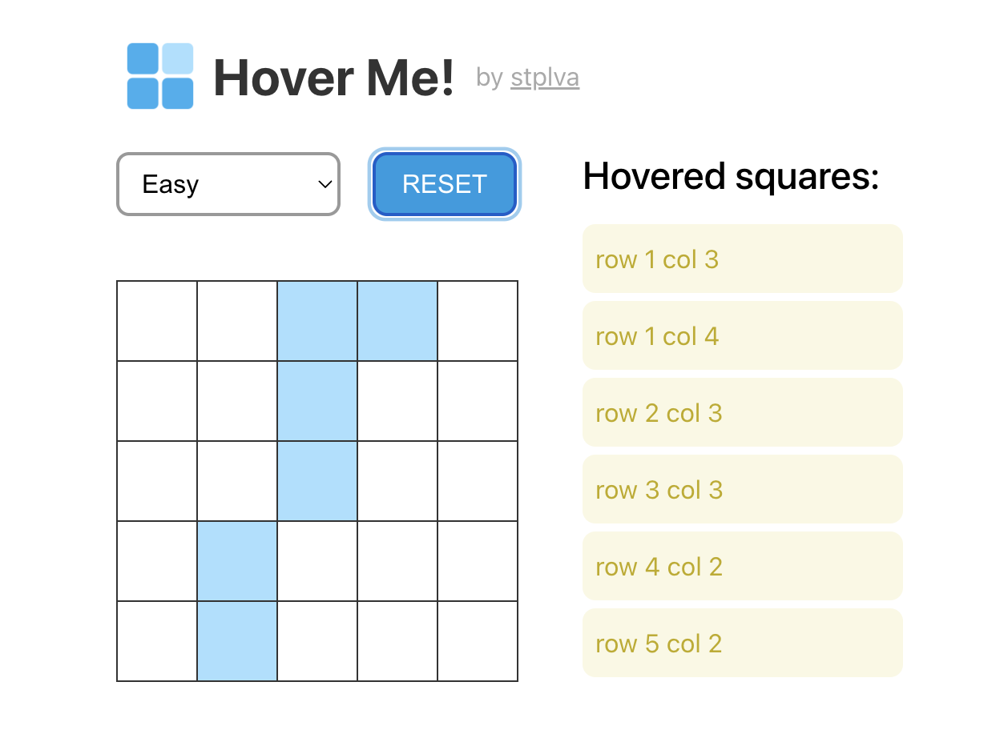

# starnavi-test-task

This is a simple Hover App as a frontend test task for StarNavi.

## Task and Demo

[DEMO](https://stplva.github.io/starnavi-test-task/)

[Task Source](https://starnavi-frontend-test-task-v3.netlify.app/)



## Development

To set up local development:

### 1. Install dependencies

```sh
npm i
```

### 2. Start development server

To start the development server at <http://localhost:3000> run:

```sh
npm run dev
```

### 3. Deploy to GitHub Pages
To deploy your changes to gh-pages run:

```sh
npm run deploy
```